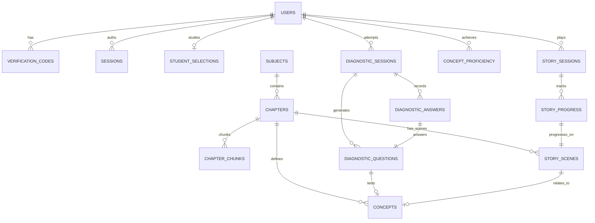
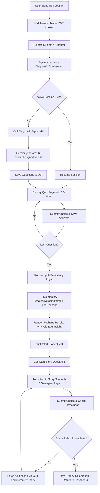

# NeuroQuest: Full Project Summary & Technical Blueprint

Welcome to **NeuroQuest**, Bangladesh's first AI-native narrative learning platform designed for secondary and higher secondary science students (SSC & HSC). This document provides a comprehensive, end-to-end technical and functional summary of the project built from the ground up.

---

## Recent Updates Log

### Date: 23 May 2026
### Title: Quiz Question Style Refactor
Changes: 
- Diagnostic quiz now generates simple factual one-line questions
- Removed scenario-based framing that overlapped with Story Quest experience
- Maintained 6-question structure with 2-easy/2-medium/2-hard difficulty split
- Story Quest remains scenario-based for immersive learning
- Two assessments now feel clearly differentiated
Files modified:
- lib/agents/diagnostic-agent.ts (Gemini prompt text only)
- full_summary.md (this log entry)

### 1. Story Quest Backend APIs Built
- **`POST /api/story/start`**: Initiates or resumes a story session for a chapter. Integrates edge-compatible JWT cookie validation (`neuroquest_session`), fetches the student's language version from `users.version` ('bangla' or 'english'), creates new active sessions (defaulting `current_scene_index` to `0` to match database schema), and returns the first or resumed scene in a cheat-proof format (excludes correct option and explanation fields).
- **`POST /api/story/submit-choice`**: Receives student choices (`a`, `b`, or `c`), verifies session ownership and active status, computes correctness, logs response into `story_progress` using `completed_at`, updates the session metadata (`scenes_completed`, `correct_choices`, `current_scene_index` incremented or marked `status = 'completed'` on scene 5), and returns bilingual correctness data along with detailed explanations.
- **`GET /api/story/next-scene`**: Fetches a specific scene by index matching the chapter of the current user session, outputting clean scene details with zero answer leakage to ensure academic integrity.

### 2. Story Quest Interactive Client Page & Navigation
- **Story Quest Page (`app/(protected)/story/[session_id]/page.tsx`)**: Built a breathtaking client page rendering 5 interactive gameplay scenes. Renders large dynamic Lucide-React icons (e.g. `Zap`, `Droplets`) in a glowing gradient canvas. Features Framer Motion entry animations, option hover-scale interactive states, a slide-in correct/incorrect explanation reveal panel, and an engaging trophy-themed final celebration page with completed stats.
- **Results Page Button Wire-Up (`app/(protected)/quiz/[session_id]/results/page.tsx`)**: Upgraded the "স্টোরি কোয়েস্ট শুরু করো" (Start Story Quest) button. Instead of a dead `/coming-soon` route, it now queries `results.session.chapter_id`, calls `POST /api/story/start` dynamically, and transitions smoothly into the newly created story session.
- **Dashboard Story Quest Card (`app/(protected)/dashboard/page.tsx`)**: Revamped the placeholder Story Quest card. When clicked, it queries the student's active selection `/api/student/selection` from the backend. If a chapter is selected, it boots up the story gameplay directly; if not, it triggers a friendly bilingual toast alert ("আগে একটি অধ্যায় নির্বাচন করুন / Please select a chapter first") and guides them to the subject selection.

---

## 1. Project Vision & Methodology

Traditional learning systems fail students due to the **cram-test-forget** cycle. NeuroQuest resolves this by mapping the national **NCTB curriculum** onto interactive, culturally contextualized **story quests** and automated diagnostic feedback, scientifically engineered to beat the **Ebbinghaus forgetting curve**.

### Key Pillars:
1. **Interactive Story Quests**: Immersive bilingual narrative lines set in Bangladesh (e.g., Sirajganj monsoon floods, Rajshahi Barind mango orchards) where physics formulas or biological pathways are core gameplay mechanics.
2. **AI-Native Diagnostic Assessments**: Adaptive diagnostic tests generated on-the-fly by Google Gemini to map student mastery.
3. **Automated Spaced Retrieval**: Tracks learning decay and prompts quizzes at intervals (7, 21, and 45 days) to ensure long-term retention.
4. **Curriculum-Aware PDF Ingestion**: Admin tool to parse NCTB textbooks, chunk contents, and auto-map granular syllabus concepts.

---

## 2. Technical Stack

- **Framework**: Next.js 14 (App Router)
- **Runtime**: Node.js & Edge Runtime (compatible with edge-middleware)
- **Database**: Supabase (PostgreSQL) with custom JWT-cookie session mapping
- **Styling**: TailwindCSS & Lucide-React icons
- **Animations**: Framer Motion (for smooth choice selection, question transitions, and explanation reveals)
- **AI Core**: Google Generative AI SDK (using `gemini-2.0-flash` models)
- **PDF Parser**: `pdf2json` with custom sliding-window offset discovery
- **Forms & Validation**: React Hook Form, Hookform Resolvers, and Zod

---

## 3. Database Architecture & Schema

The database is built on a clean PostgreSQL schema structured into database migrations:



### Schema Breakdown

#### Migration 1: `001_initial.sql` (Authentication & Users)
- **`users`**: Core profiles storing name, email, birthdate (restricting registration to students aged 13-25), class (`ssc`, `hsc_1`, `hsc_2`), language version (`bangla`, `english`), password hashes (`bcryptjs`), and verification status.
- **`verification_codes`**: 6-digit numeric OTP codes for email verification (`signup`) and password resets (`reset`), featuring expiry timestamps and safety flags.
- **`sessions`**: Custom JWT cookie persistence tracking user session lifespans (30 days).

#### Migration 2: `002_curriculum.sql` (NCTB Syllabus Mapping)
- **`subjects`**: Lookup table containing metadata for curriculum items (e.g. Grade 9-10 Physics/Biology).
- **`chapters`**: Specific chapters mapped to starting and ending pages inside textbooks, including current ingestion status (`pending`, `ingesting`, `ingested`, `failed`).
- **`concepts`**: High-granularity syllabus topics (5 key concepts mapped per chapter) detailing difficulty levels (1-5) and display order.
- **`chapter_chunks`**: Pre-processed textbook text paragraphs split dynamically into 500-token blocks to serve as context for RAG or chatbot workflows.
- **`student_selections`**: Quick-lookup cache detailing the active subject and chapter selected by each user.

#### Migration 3: `003_diagnostic_and_story.sql` (Diagnostic & Gameplay Loops)
- **`diagnostic_sessions`**: Session headers for AI-generated diagnostic tests including completion status, correct counts, overall percentage score, and AI-generated diagnostic feedback.
- **`diagnostic_questions`**: Holds the AI-generated multiple-choice questions, custom options (A-D), correct answers, explanations, and corresponding concept tags.
- **`diagnostic_answers`**: Performance log tracking selected student choices, correctness flags, and time taken (seconds).
- **`concept_proficiency`**: Permanent ledger tracking student mastery levels (`weak`, `developing`, `strong`) per syllabus concept.
- **`story_scenes`**: Content library for interactive narrative story quests storing bilingual text fields (BN/EN), interactive prompt questions, choices (A-C), feedback explanations, and custom display icons. Already seeded with 10 scenes (Physics Ch 4 & Biology Ch 4).
- **`story_sessions`**: Tracks active student gameplay through story scenes. Adapted by frontend/backend to fit columns:
  - `id` (UUID, PRIMARY KEY)
  - `user_id`, `chapter_id` (foreign keys)
  - `version` (CHECK bangla/english)
  - `current_scene_index` (INTEGER, defaults to `0`)
  - `status` (CHECK active/completed/abandoned)
  - `scenes_completed`, `correct_choices` (score ledgers)
  - `started_at`, `completed_at` (timestamps)
- **`story_progress`**: Ledger of completed narrative milestones tracking:
  - `id` (UUID, PRIMARY KEY)
  - `session_id`, `scene_id` (foreign keys)
  - `selected_option` (CHAR(1))
  - `is_correct` (BOOLEAN)
  - `completed_at` (TIMESTAMPTZ timestamp)

---

## 4. Immersive MVP Stories & Seeds

To bootstrap our learning model, we have constructed two highly engaging, culturally resonant educational story tracks fully localized for Bangladeshi students:

### Track 1: Physics Chapter 4 — Work, Power & Energy
- **Story Context**: Set in Sirajganj district. A severe monsoon storm snaps power lines, throwing a small village into absolute darkness. 14-year-old **Rafi** sets off on a quest to restore power using natural stream flows.
- **The Core Gameplay Loop**:
  1. **Scene 1 (Introduction)**: Rafi plans how to light up the dark village.
  2. **Scene 2 (Work)**: Rafi helps his grandmother draw water from an old deep well, learning that **Work = Force × Displacement**.
  3. **Scene 3 (Power)**: Rafi designs a water wheel in the canal and compares wheel speed vs torque, mastering that **Power = Work ÷ Time**.
  4. **Scene 4 (Energy Conversion)**: A ripe mango falls on Rafi's head while resting under a tree, revealing the conversion of **Potential Energy (PE) to Kinetic Energy (KE)**.
  5. **Scene 5 (Conservation)**: Rafi mounts a dynamo to the water wheel to convert **Kinetic → Mechanical → Electrical → Light Energy**, successfully illuminating the village and grasping the **Principle of Conservation of Energy**.

### Track 2: Biology Chapter 4 — Bioenergetics
- **Story Context**: Set in the Rajshahi Barind region. An old family mango tree is turning yellow and losing its leaves during a hot summer, failing to bear fruit. 13-year-old **Tania** embarks on a quest to save the tree.
- **The Core Gameplay Loop**:
  1. **Scene 1 (Introduction)**: Tania investigates why her family's beloved tree is dying.
  2. **Scene 2 (Chlorophyll)**: Under her grandmother's old magnifying glass, Tania observes chloroplasts in green leaves and discovers how **Chlorophyll** absorbs sunlight.
  3. **Scene 3 (Photosynthesis)**: Tania imagines talking directly to the sun, decoding the chemical equation: **6CO₂ + 6H₂O + Light Energy → C₆H₁₂O₆ + 6O₂**.
  4. **Scene 4 (Respiration)**: Tania wonders how the tree survives during the dark night without sunlight, learning the role of 24-hour **Respiration**: **C₆H₁₂O₆ + 6O₂ → 6CO₂ + 6H₂O + Energy (ATP)**.
  5. **Scene 5 (ATP)**: Tania maps out the concept of **ATP** as the "energy currency of the cell," discovering that the tree is weak because it isn't producing enough ATP.

---

## 5. System Features & Workflows



### 1. Registration & Auth Middleware
- **Bilingual Dashboard**: Features a beautiful glassmorphic panel in either Bangla or English based on preferences.
- **Custom JWT Auth Middleware**: Securely intercepts Next.js navigation routers. If a session expires or is missing, it cleans up cookies and redirects to `/login`.
- **Validation**: Birthdate checks ensure the user's age is between 13 and 25. Passwords require strong alphanumeric patterns.

### 2. AI-Native Diagnostic Assessment Engine (`lib/agents/diagnostic-agent.ts`)
- **Dynamic MCQ Generation**: Connects to the **Google Generative AI SDK**.
- **Multi-Model Backup Fallback**: Implements a robust multi-model try-catch block (falling back from `gemini-2.0-flash` to backup models) to guarantee 100% API uptime.
- **Bangladeshi Context Injection**: Prompts the AI to output exactly 6 questions matching easy, medium, and hard difficulty tiers. Questions are generated in pure Bangla or English, utilizing local terms and Bangla numerals.
- **Automated Proficiency Scoring**: As soon as the student clicks "Submit" on the final question, the backend triggers `computeProficiency()` to calculate percentage grades per concept and push dynamic upserts to `concept_proficiency`.

### 3. Gorgeous Real-Time Quiz Interface (`app/(protected)/quiz/[session_id]/page.tsx`)
- **60-Second Question Timer**: Incorporates an animated countdown timer that changes color (green to yellow to flashing red) as time runs out.
- **Interactive Choice Panel**: Renders smooth entrance animations via Framer Motion. Checked options light up in premium primary brand gradients.
- **Results Analysis**: Presents a gorgeous vertical Recharts bar graph displaying granular mastery breakdown alongside custom, glowing AI insights.

### 4. Interactive Story Quest Gameplay (`app/(protected)/story/[session_id]/page.tsx`)
- **Bilingual Narrative Slides**: Shows beautiful storytelling blocks styled with modern typography, custom margins, and spacious line-heights.
- **Framer Motion Micro-Animations**: Card elements rise (`y: 15`), choices animate on hover (`scale: 1.01`), and correct/incorrect explanation slides fade in instantly based on submission results.
- **Adaptive Database Indexes**: Starts automatically from index `1` if the database `current_scene_index` is `0`, tracking steps cleanly through `story_progress` tables and updating totals.
- **Trophy Celebration**: On completes, features a stunning screen displaying completion stats alongside an animated trophy card to reward students.

### 5. Curved Admin Ingest System
- **File Upload Handler**: Admins can upload NCTB textbooks under `/data/textbooks/` (e.g. `physics_bn.pdf`).
- **Sliding-Window Offset Engine**: Automatically solves the offset problem. It calculates matching text densities over candidate page boundaries to find the most accurate page ranges.
- **Granular Text Chunking**: Chunks pages into 500-token blocks to store them in the DB for RAG.

---

## 6. Project Layout

```bash
NeuroQuest/
├── app/                        # Next.js App Router Pages & APIs
│   ├── (auth)/                 # Guest auth routes (login, signup, OTP, reset)
│   ├── (protected)/            # Core client routes (dashboard, quiz, settings)
│   │   ├── story/[session_id]/ # Story Quest gameplay page
│   │   ├── quiz/[session_id]/  # Quiz and Results page
│   │   └── settings/           # Profile preferences updates
│   ├── admin/ingest/           # Admin PDF Ingest layout page
│   ├── api/                    # API Route Handlers
│   │   ├── admin/              # PDF Ingestion API endpoints
│   │   ├── auth/               # Signup, login, reset, and verification APIs
│   │   ├── curriculum/         # Subjects & chapters APIs
│   │   ├── story/              # Start, submit-choice, and next-scene gameplay APIs
│   │   ├── user/               # Settings preferences updates
│   │   └── student/            # Chapter selection endpoints
│   ├── fonts/                  # Geist VF and GeistMono VF fonts
│   ├── globals.css             # Base CSS styles & theme systems
│   └── layout.tsx              # HTML structure wrappers
├── components/                 # Reusable UI Components
│   ├── layout/                 # Global bilingually-aware Header and Footer
│   └── ui/                     # Shadcn-tailored custom UI elements
├── data/                       # Directory containing source NCTB textbooks
├── db/                         # Database Migration and Seed scripts
│   ├── migrations/             # SQL Migration files (001, 002, 003)
│   └── seed/                   # Bootstrap seeds (Curriculum & Stories)
├── lib/                        # Backend and Frontend Utilities
│   ├── agents/                 # AI diagnostic generator & scoring engine
│   ├── auth.ts                 # Encryption and random OTP helpers
│   ├── email.ts                # OTP email dispatcher (Resend)
│   ├── jwt-edge.ts             # Lightweight Edge JWT parser
│   ├── pdf-parser.ts           # PDF extraction, sliding window & chunking
│   ├── supabase.ts             # Supabase clients (Server and Client)
│   ├── utils.ts                # Styling class consolidator (cn)
│   └── validators.ts           # Strict Zod schemas
└── package.json                # Project dependencies and workspace scripts
```

---

## 7. How to Setup & Run locally

### Prerequisites
- Node.js (v18 or higher)
- Supabase account & project database
- Google Gemini API Key
- Resend API Key (for OTP emails)

### 1. Environment Configuration
Create a `.env.local` file in the root directory:
```env
NEXT_PUBLIC_SUPABASE_URL=your_supabase_url
NEXT_PUBLIC_SUPABASE_ANON_KEY=your_anon_key
SUPABASE_SERVICE_ROLE_KEY=your_service_role_key
JWT_SECRET=your_secure_32_character_jwt_secret
GEMINI_API_KEY=your_google_gemini_api_key
RESEND_API_KEY=your_resend_api_key
```

### 2. Database Migration & Seeding
1. Go to your **Supabase Dashboard** -> **SQL Editor**.
2. Run the migration files in order:
   - `db/migrations/001_initial.sql`
   - `db/migrations/002_curriculum.sql`
   - `db/migrations/003_diagnostic_and_story.sql`
3. Load the curriculum and story seeds:
   - `db/seed/001_curriculum.sql`
   - `db/seed/002_story_scenes.sql`

### 3. Running the Development Server
```bash
npm install
npm run dev
```
Open [http://localhost:3000](http://localhost:3000) to experience NeuroQuest.

---

*NeuroQuest: Revolutionizing education in Bangladesh with AI-powered, story-driven learning paths.*

---

## MCP Server Integration (Added in this session)

Built a standalone Model Context Protocol (MCP) server in the `mcp-server/` folder to expose NeuroQuest's NCTB curriculum data to external AI tools (Cursor, Claude Desktop, custom agents).

**What was added:**
- New folder: `mcp-server/` (fully isolated from main Next.js app)
- Standalone Node.js TypeScript subproject with its own package.json, tsconfig.json, and node_modules
- 4 MCP tools exposed via stdio transport:
  - `list_subjects` — returns all subjects (Physics, Biology)
  - `list_chapters` — returns chapters for a given subject_id
  - `get_concept` — returns concept details by concept_id
  - `list_story_scenes` — returns story scenes for a given chapter_id
- Read-only Supabase access using ANON key (never service role)
- Smoke-test script in `mcp-server/scripts/inspect-schema.mjs`
- README.md inside mcp-server/ with setup instructions

**What was NOT changed:**
- Zero modifications to the main Next.js app
- Zero changes to root package.json, middleware.ts, .env.local, or any existing file
- Main app's database, auth, and gameplay logic untouched

**How to verify:**
```bash
cd mcp-server && npm run build && node dist/index.js
```
Should print: "NeuroQuest Curriculum MCP Server running on stdio"

**Cursor integration:**
Config added to `~/.cursor/mcp.json` (or `%APPDATA%\Cursor\mcp.json` on Windows) pointing to `mcp-server/dist/index.js`. Tested by querying "list NeuroQuest subjects using the neuroquest-curriculum MCP tool" in Cursor.
